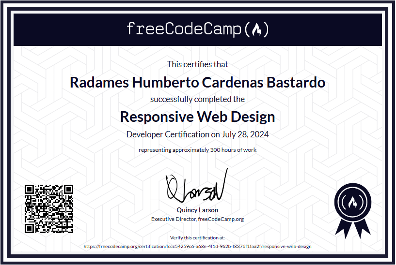
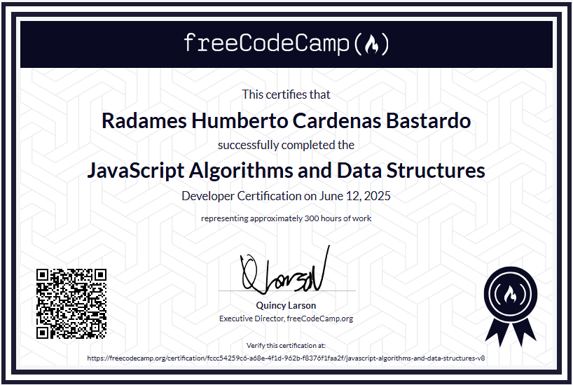

 

  
  <!-- GitHub Visitors -->
  
  
  <!-- LinkedIn -->
  

<h2>📖 | About me</h2> 

🌐  
Full-Stack Developer with 2 years of experience, mainly focused on building modern and scalable web applications, particularly administrative systems, with over 10 years of experience in the IT field, specializing in software, hardware, and network maintenance.

<h2>📚 | Education</h2>

After obtaining my Associate Degree in Informatics, I have pursued continuous and independent learning with an active and ambitious mindset. My goal is to learn something new every day and transform that knowledge into practical solutions, developing real projects that strengthen both my technical expertise and my ability to innovate.
 

  <table style="margin-left: auto; margin-right: auto;">
    <tr>
      <!-- IUTEPAL -->
      <td align="center">
        
         
        
      </td>
      <!-- Responsive Web Design -->
      <td align="center">
        
         
        
      </td>
      <!-- JavaScript Algorithms and Data Structures -->
      <td align="center">
        
         
        
      </td>
      <!-- Unity Badge -->
      <td align="center">
        
         
        
      </td>
    </tr>
     <!-- Unity Badge  Junior-->
      <td align="center">
          
         
         
      </td>
    </tr>
  </table>

<h2>⭐ | Github Stats </h2>

<h2>🛠️ | Languages, Frameworks, and Tools </h2>
<table>
    <tr>
        <td style="font-weight: bold; padding-right: 10px; vertical-align: center;">Frontend:</td>
        <td>
            
        </td>
    </tr>
    <tr>
        <td style="font-weight: bold; padding-right: 10px; vertical-align: center;">Backend:</td>
        <td>
            
        </td>
    </tr>
    <tr>
        <td style="font-weight: bold; padding-right: 10px; vertical-align: center;">Database:</td>
        <td>
            
        </td>
    </tr>
    <tr>
        <td style="font-weight: bold; padding-right: 10px; vertical-align: center;">Version Control:</td>
        <td>
            
        </td>
    </tr>
    <tr>
        <td style="font-weight: bold; padding-right: 10px; vertical-align: center;">Other Tools / CMS:</td>
        <td>
            
        </td>
    </tr>
</table>

------
**Credits :** [codediaz](https://github.com/codediaz)

**Last Edited on:** 06/04/2024
